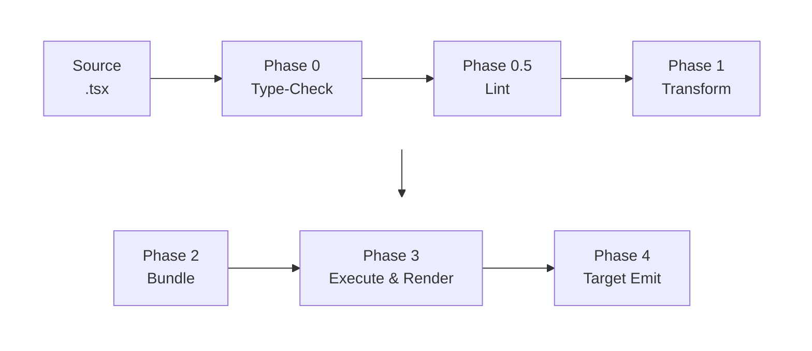

# ESPCompose Architecture Overview

ESPCompose is a TypeScript-to-ESPHome compiler. You write UI and automation logic in JSX/TSX, and the compiler produces ESPHome YAML configuration plus C++ header files that run on ESP32 microcontrollers. There is also a browser-based simulator for previewing LVGL UIs without hardware.

## Packages

- **`@espcompose/core`** — Core runtime: JSX execution, reactive hooks, the Semantic IR type system, and the target interface that backends implement.
- **`@espcompose/cli`** — Compiler and CLI: AST transforms, bundling, build orchestration, and the `espcompose` command.
- **`@espcompose/eslint`** — Custom ESLint rules that catch JSX correctness issues specific to ESPCompose.
- **`@espcompose/ui`** — Pre-built UI components, layout primitives, and the theme system for LVGL displays.

## Compiler Pipeline

The compiler runs six phases to turn a `.tsx` source file into ESPHome configuration:



### Phase 0: Type-Check

The TypeScript compiler performs full type-checking on the source files. Type errors fail the build before any transforms run.

### Phase 0.5: Lint

ESLint runs on the original source files using the project's custom ESPCompose rules. This catches JSX correctness issues before transformation.

### Phase 1: AST Transform

The TypeScript AST is visited file-by-file. Two transformers run on each file:

- **Reactive Transformer** — Finds JSX attributes and `useMemo()` calls that reference reactive values (signals from Home Assistant entities or theme variables). It extracts these into a target-agnostic expression IR, identifies dependencies, infers return types, and replaces the original code with pre-computed metadata.

- **Script Transformer** — Finds arrow functions on trigger props (e.g. `onPress`, `on_state`) and compiles them into action trees — a structured representation of imperative ESPHome actions like `delay`, `if-then-else`, `repeat`, service calls, and ref method invocations.

Transformed files are written to `.espcompose-build/`.

### Phase 2: Bundle

esbuild bundles the transformed TypeScript into a single CommonJS file. The core SDK is kept external — it will be provided at execution time. Library format versions are validated here to catch incompatible pre-compiled dependencies.

### Phase 3: Execute & Render

The bundled file is loaded in Node.js. The SDK's render function walks the JSX tree recursively — function components are called, intrinsic elements become config sections, and LVGL widgets are processed through a dedicated builder. The output is a **Semantic IR** — a tree of typed nodes that preserve all metadata (reactive bindings, refs, actions, secrets) without any target-specific encoding.

### Phase 4: Target Emit

The compiler delegates to a target backend, passing the Semantic IR and project paths. The compiler has no knowledge of what the target does.

- **ESPHome target** — Generates C++ headers for the reactive runtime, a full ESPHome YAML configuration, and copies asset files.
- **Simulator target** — Converts the IR into an HTML page with canvas rendering and mock HA entity state, then opens it in the browser.

## Reactive System

The reactive system tracks dependencies between Home Assistant entities and UI properties, generating a C++ signal graph that updates widgets automatically when entity state changes.

Three hooks form the reactive API:

- **`useHAEntity(id)`** — Binds to a Home Assistant entity and returns typed signals for its properties.
- **`useMemo(fn)`** — Derives a value from one or more signals.
- **`useEffect(fn)`** — Runs side effects when dependencies change.

Each hook creates a reactive node that carries a target-agnostic expression tree, a return type, and its upstream dependencies. During Phase 1, the AST compiler builds these expression trees. During Phase 4, backends lower them to target code (C++ lambdas for ESPHome, JavaScript for the simulator).

## Theme System

Themes are plain TypeScript objects with nested color, spacing, and typography values:

```tsx
const theme = { colors: { primary: { bg: '#1E88E5' } }, spacing: { md: 8 } };
```

At render time, the theme is flattened into a map of leaf paths to values with inferred types. When a component reads a theme value, a reactive expression is created. The ESPHome backend generates C++ memos that index into theme value arrays, enabling runtime theme switching without re-rendering.

## Action System

Arrow functions on trigger props are compiled into structured action trees:

```tsx
<button onPress={() => {
  myLight.turnOn({ brightness: 0.5 });
  await delay(1000);
  if (someCondition) { myLight.turnOff(); }
}} />
```

The action compiler supports native component actions, Home Assistant service calls, delays, conditionals, loops, script execution, and theme selection. Each action becomes a node in the Semantic IR, which the YAML backend serializes to ESPHome action blocks.

## Library Compilation

Component libraries can be pre-compiled with `espcompose build --library` so consumers don't need the TypeScript source:

1. AST transform runs on library sources (same reactive + script transforms)
2. esbuild bundles to ESM
3. TypeScript emits `.d.ts` declarations
4. A format version marker is injected

At consumer build time, the compiler validates that imported libraries match the current format version. Mismatched versions produce a clear error with rebuild instructions.

## Asset Pipeline

Images and fonts referenced in JSX are tracked during the render pass. At emit time, source files are resolved relative to the project root and copied to the output directory. Font metadata is captured and injected into the LVGL configuration section.

## Simulator

The simulator is an alternative backend that produces a browser-based LVGL preview from the same Semantic IR. It converts reactive expressions to JavaScript, generates an HTML page with canvas rendering and mock HA entity state, and opens it in the browser.
